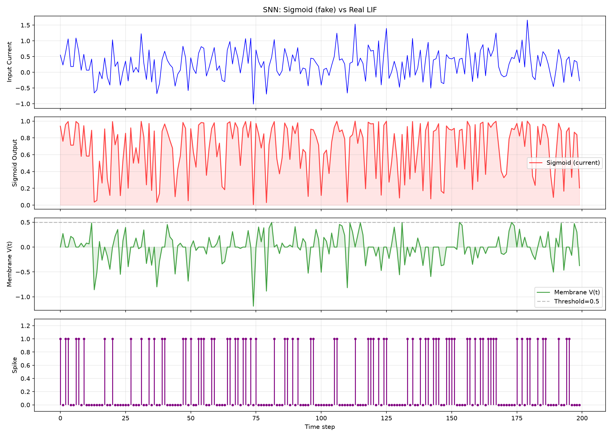

# M.A.T.E.R.I.A. — Documentacion Maestra

**Multi-Analytical Toroidal Engine for Recursive Intelligent Analysis**

---

## Índice

1. [Introducción](#1-introduccion)
   - 1.1 [Que es M.A.T.E.R.I.A.?](#11-que-es-materia)
   - 1.2 [Historia del Proyecto](#12-historia-del-proyecto)
   - 1.3 [Incidente Crítico](#13-incidente-critico-31-marzo-2026)
2. [Arquitectura del Sistema](#2-arquitectura-del-sistema)
3. [Taxonomía de Modelos](#3-taxonomia-de-modelos)
   - 3.1 [Tipos de Archivos](#31-tipos-de-archivos)
   - 3.2 [Estado de Modelos](#32-estado-de-modelos)
4. [Catálogo de Modelos .basemateria](#4-catalogo-de-modelos-basemateria)
   - 4.1 [Modelo Base Activo](#41-modelo-base-activo)
   - 4.2 [Módulos .materia disponibles](#42-modulos-materia-disponibles)
   - 4.3 [Modelos Base Respaldados](#43-modelos-base-respaldados-legacy)
5. [Catálogo de Módulos .materia](#5-catalogo-de-modulos-materia)
   - 5.1 [Sub-Agentes Umbra](#51-sub-agentes-umbra)
   - 5.2 [Módulos de Expansión](#52-modulos-de-expansion-86-total)
6. [Modelos Science](#6-modelos-science)
   - 6.1 [Modelos Existentes](#61-modelos-existentes)
   - 6.2 [Modelos Perdidos](#62-modelos-perdidos-v1-science-y-v2-science)
   - 6.3 [Scripts para Re-entrenar](#63-scripts-para-re-entrenar)
7. [M.A.T.E.R.I.A. V3](#7-materia-v3)
   - 7.1 [Arquitectura From Scratch](#71-arquitectura-from-scratch)
   - 7.2 [Estado Actual](#72-estado-actual)
   - 7.3 [Módulos .materia disponibles](#73-modulos-materia-disponibles)
   - 7.4 [Verificación SNN](#74-verificacion-snn-spiking-neural-network)
   - 7.5 [HSAQ vs Google TurboQuant](#75-hsaq-vs-google-turboquant)
   - 7.6 [Inspiración Google AGI](#76-inspiracion-google-agi-lamda-gato-palm)
   - 7.7 [Métricas de Entrenamiento](#77-metricas-de-entrenamiento)
   - 7.8 [Próximos Pasos](#78-proximos-pasos)
8. [Estado de Respaldos](#8-estado-de-respaldos)
   - 8.1 [Respaldo en Almacenamiento Externo](#81-respaldo-en-almacenamiento-externo)
   - 8.2 [Lo Que Falta Recuperar](#82-lo-que-falta-recuperar)
9. [Plan de Acción](#9-plan-de-accion)
   - 9.1 [Prioridad Alta](#91-prioridad-alta-recuperacion-de-modelos)
   - 9.2 [Prioridad Media](#92-prioridad-media-completar-arquitectura-v3)
   - 9.3 [Prioridad Baja](#93-prioridad-baja-estandarizacion-y-calidad)
10. [Apéndice A: Scripts Clave](#apendice-a-scripts-clave)
11. [Apéndice B: Glosario](#apendice-b-glosario)

---

## 1. Introducción

### 1.1 Que es M.A.T.E.R.I.A.?

M.A.T.E.R.I.A. es un sistema de IA que integra lo mejor de **cuatro paradigmas de modelado**:

- **LLM** (Large Language Models) — Razonamiento textual y comprension del lenguaje
- **SNN** (Spiking Neural Networks) — Deteccion de patrones temporales y eventos
- **SSM** (State Space Models) — Procesamiento de secuencias largas y contexto extendido
- **JEPA** (Joint Embedding Predictive Architecture) — Prediccion en espacio latente sin reconstruccion

El nucleo del sistema es un **motor de autoentrenamiento incremental** (Google-Style Self-Training) que permite al sistema aprender y mejorar continuamente sin intervencion manual. Los modelos se organizan en dos categorias principales:

- **.basemateria** — Modelo base del sistema (el "cerebro")
- **.materia** — Módulos de conocimiento adicional que expanden las capacidades del base

### 1.2 Historia del Proyecto

| Version | Período    | Descripción |
|---------|------------|-------------|
| **V1**  | 2025-10-08 | Primeras implementaciones predictivas. Concepto de .basemateria. |
| **V2**  | 2026-02-12 | Expansión a 87+ módulos .materia. Modelos GGUF base. |
| **V3**  | 2026-04-20 | Arquitectura desde cero. Integracion LLM+SNN+SSM+JEPA. Autoentrenamiento incremental. |

### 1.3 Incidente Crítico (31 Marzo 2026)

El 31 de marzo de 2026, directorios del sistema fueron eliminados accidentalmente. Esto resulto en la perdida de algunos modelos .basemateria y sus pesos GGUF asociados. El engine fue recuperado desde backup.

---

## 2. Arquitectura del Sistema

### 2.1 Vision General

M.A.T.E.R.I.A. es un meta-sistema de IA que opera en cuatro capas jerarquicas. Cada capa tiene una responsabilidad especifica y se comunica con las adyacentes mediante un flujo de datos bien definido. El sistema completo se autoentrena mediante un bucle de retroalimentación continua inspirado en los metodos de self-training de Google.

### 2.2 Capas de la Arquitectura

**Capa 1 - Core de Autoentrenamiento Incremental:** El nucleo del sistema implementa un bucle de aprendizaje continuo que opera sin intervencion manual. Cada interaccion (inferencia) retroalimenta el modelo, permitiendo una mejora progresiva. Este enfoque esta inspirado en los sistemas de self-training de Google, donde el modelo genera sus propios datos de entrenamiento a partir de las interacciones, los filtra por calidad, y los incorpora al conjunto de aprendizaje.

**Capa 2 - Arquitecturas de Modelado Integradas:** M.A.T.E.R.I.A. no esta limitado a un unico paradigma de modelado. Integra cuatro arquitecturas complementarias:
- **LLM** para razonamiento textual y comprension del lenguaje natural
- **SNN** para deteccion de patrones temporales y eventos con baja latencia
- **SSM** para procesamiento de secuencias largas con contexto extendido
- **JEPA** para prediccion en espacio latente sin necesidad de reconstruccion

El sistema selecciona automáticamente la arquitectura óptima según el tipo de entrada y el contexto de la solicitud.

**Capa 3 - Modelos .basemateria:** Los archivos `.basemateria` definen los modelos base del sistema. Contienen la configuracion completa del modelo, las referencias al backend de inferencia, y en algunos casos los pesos entrenados del modelo JEPA. Actuan como el "cerebro" del sistema.

**Capa 4 - Módulos .materia:** Los archivos `.materia` son módulos de conocimiento adicional que expanden las capacidades del modelo base. Se cargan dinámicamente y proporcionan conocimiento especializado en dominios específicos (automation, desarrollo web, seguridad, etc.).

### 2.3 Flujo de Datos

El flujo completo de una solicitud a traves del sistema es:

1. **Entrada**: El usuario ingresa un prompt o dato (texto, audio, etc.)
2. **Core Autoentrenable**: Evalua la entrada y selecciona la arquitectura de modelado óptima
3. **Carga de Modelo**: Se carga el `.basemateria` correspondiente como base
4. **Aplicación de Módulos**: Se aplican los `.materia` relevantes como conocimiento adicional
5. **Inferencia**: Se ejecuta la inferencia a traves del backend seleccionado (Ollama, llama.cpp, o Cloud API)
6. **Retroalimentacion**: La respuesta se retroalimenta al core para mejorar en la siguiente iteracion

### 2.4 Diagrama de Arquitectura

```
+-------------------------------------------------------------+
|  CORE: Autoentrenamiento Incremental (Google-Style)          |
|  Self-Training Loop  |  Aprendizaje Continuo                |
+---------------------------+---------------------------------+
                            |
+---------------------------v---------------------------------+
|  ARQUITECTURAS DE MODELADO INTEGRADAS                       |
|  LLM  |  SNN  |  SSM  |  JEPA                               |
|  (Texto) (Patrones) (Secuencias) (Latente)                  |
+---------------------------+---------------------------------+
                            |
+---------------------------v---------------------------------+
|  MODELOS .basemateria (BASE DEL SISTEMA)                    |
|  materia-base | materia-core | materia-science              |
|  materia-security | materia-recovery | otros                |
+---------------------------+---------------------------------+
                            |
+---------------------------v---------------------------------+
|  MODULOS .materia (CONOCIMIENTO ADICIONAL)                  |
|  auto-* | axum-* | phantom-* | mobile-ui | otros           |
+---------------------------+---------------------------------+
                            |
+---------------------------v---------------------------------+
|  Backend de Inferencia                                      |
|  Ollama / llama.cpp / Cloud API                             |
+-------------------------------------------------------------+
```

---

## 3. Taxonomía de Modelos

### 3.1 Tipos de Archivos

El sistema M.A.T.E.R.I.A. utiliza dos formatos de archivo principales, cada uno con un proposito especifico dentro de la arquitectura:

| Extension       | Rol                               | Contenido                                       | Tamano Tipico |
|-----------------|-----------------------------------|-------------------------------------------------|---------------|
| **.basemateria**| Modelo BASE del sistema           | Config + metadatos de entrenamiento             | 520 B - 1 KB  |
| **.materia**    | Modulo de expansion de conocimiento | JSON (sub-agente Umbra) o pesos binarios       | 362 B - 75 MB |

**.basemateria:** Es el **modelo base** del sistema, el "cerebro". Contiene la configuracion completa, los metadatos de entrenamiento y la referencia al backend de inferencia (Ollama). Solo debe existir UN .basemateria activo como base del sistema.

**.materia:** Son **módulos de expansión** que se cargan sobre el .basemateria para extender sus capacidades. Pueden ser:
- **JSON Module**: Archivo JSON con config de sub-agente Umbra (formato estandar del proyecto, ej: `science-v3.materia`)
- **Weight Module**: Pesos binarios serializados (pickle) para cargar en el modelo base
- **Python Module**: Scripts Python que extienden la funcionalidad

### 3.2 Estado de Modelos

| Modelo                              | Estado               | Notas                          |
|-------------------------------------|----------------------|--------------------------------|
| materia-v3.basemateria              | ✅ ENTRENADO         | BaseModel activo (678K params) |
| materia-v3.materia (pesos)          | ✅ GENERADO          | 2.7MB weight module            |
| materia-v3-full.materia             | ✅ MODULO            | 8.1M params (expansion)        |
| materia-v3-extended.materia         | ✅ MODULO            | 3.2M params (expansion)        |
| materia-v3-unified.materia          | ✅ MODULO            | 2.2M params (unificado)        |
| materia-v3-nano.materia             | ✅ MODULO            | 4.1M params (ligero)           |
| science-v3.materia                  | 📦 DISPONIBLE        | Modulo cientifico              |
| science-v3-part-1.materia           | 📦 DISPONIBLE        | Ciencias exactas               |
| science-v3-part-2.materia           | 📦 DISPONIBLE        | Ciencias biologicas            |
| science-v3-part-3.materia           | 📦 DISPONIBLE        | Ingenieria y computacion       |
| materia-v1.basemateria              | ❌ PERDIDO           | Incidente 31 marzo 2026        |
| materia-v2.basemateria              | ❌ PERDIDO           | Incidente 31 marzo 2026        |
| materia-base.basemateria            | 💾 RESPALDADO        | Backup externo                 |
| materia-core.basemateria            | 💾 RESPALDADO        | Backup externo                 |
| materia-security.basemateria        | 💾 RESPALDADO        | Backup externo                 |
| materia-science-* (5 modulos)       | 💾 RESPALDADOS       | Backup externo                 |
| materia-recovery-* (2 modulos)      | 💾 RESPALDADOS       | Backup externo                 |

**.basemateria activo:** `materia-v3.basemateria` — el unico modelo base del sistema.
**.materia:** Todos los demas archivos son módulos que se cargan sobre el base.

---

## 4. Catálogo de Modelos .basemateria

### 4.1 Modelo Base Activo

| Archivo                              | Proposito                      | Params | Estado |
|--------------------------------------|--------------------------------|--------|--------|
| `materia-v3.basemateria`             | Modelo base del sistema (V3)   | 678,784| ✅ ENTRENADO |

**NOTA:** Solo existe UN .basemateria activo. Los demas modelos han sido convertidos a módulos .materia.

### 4.2 Módulos .materia disponibles

| Archivo                                | Proposito                      | Arquitectura | Estado |
|----------------------------------------|--------------------------------|--------------|--------|
| `materia-v3-full.materia`              | Expansion 4 capas (8.1M)       | GQA+JEPA     | ✅ Entrenado |
| `materia-v3-extended.materia`          | Multi-arquitectura (3.2M)      | LLM+SNN+SSM  | ✅ Entrenado |
| `materia-v3-unified.materia`           | Unificado (2.2M)               | LLM+SNN+SSM  | ✅ Entrenado |
| `materia-v3-nano.materia`              | Ligero (4.1M)                  | GQA+JEPA     | ✅ Pre-entrenado |
| `materia-v3.materia`                   | Pesos del base model (2.7MB)   | —            | ✅ Generado |
| `science-v3.materia`                   | Conocimiento cientifico        | LLM+JEPA     | 📦 Disponible |
| `science-v3-part-1.materia`            | Ciencias exactas               | LLM+JEPA     | 📦 Disponible |
| `science-v3-part-2.materia`            | Ciencias biologicas            | LLM+JEPA     | 📦 Disponible |
| `science-v3-part-3.materia`            | Ingenieria y computacion       | LLM+JEPA     | 📦 Disponible |

### 4.3 Modelos Base Respaldados (legacy)

| Archivo                                          | Proposito                   | Estado |
|--------------------------------------------------|-----------------------------|--------|
| `materia-base.basemateria`                       | Modelo base completo (V3)   | 💾 Respaldado |
| `materia-core.basemateria`                       | Nucleo del sistema          | 💾 Respaldado |
| `materia-consolidated.basemateria`               | Version consolidada engine  | 💾 Respaldado |
| `materia-security.basemateria`                   | Seguridad y ciberseguridad  | 💾 Respaldado |
| `materia-recovery-authenticator.basemateria`     | Autenticador recuperacion   | 💾 Respaldado |
| `axum-geez-translation.basemateria`              | Traduccion Ge'ez            | 💾 Respaldado |
| `mobile-ui-2026-amoled-optimization.basemateria` | UI movil AMOLED             | 💾 Respaldado |

---

## 5. Catálogo de Módulos .materia

### 5.1 Sub-Agentes Umbra

| Modulo             | Agente    | Modelo Base      |
|--------------------|-----------|------------------|
| `trader.materia`   | Trader    | qwen2.5:7b       |
| `analyst.materia`  | Analyst   | llama3.2:3b      |
| `voice.materia`    | Voice     | whisper:tiny     |
| `monitor.materia`  | Monitor   | tinyllama:latest |

### 5.2 Módulos de Expansión (~78 total)

| Categoria     | Cantidad | Ejemplos                                               |
|---------------|----------|--------------------------------------------------------|
| auto-*        | ~55      | auto-scripts, auto-kernel-hardening, auto-bio-spectrum |
| phantom-agents| ~12      | phantom-orchestrator, phantom-c2-rat, phantom-payload  |
| axum-*        | ~8       | axum-architecture, axum-mobile, axum-pqc-security      |
| mobile-ui     | ~1       | mobile-ui-2026-amoled-optimization                     |
| otros         | ~5       | reverse-eng, dev-general, cli-tools                    |

---

## 6. Modelos Science

### 6.1 Modelos Existentes

Los siguientes modelos .basemateria science existen:

```
materia-science.basemateria           -> Conocimiento cientifico general (666 B)
materia-science-general.basemateria   -> Ciencia multi-dominio (98 B)
materia-science-arxiv.basemateria     -> Papers de arXiv (260 B)
materia-science-qa.basemateria        -> QA cientifica (252 B)
materia-science-summarize.basemateria -> Resumen cientifico (282 B)
```

**IMPORTANTE:** Archivos de texto. Los GGUF reales se perdieron.

### 6.2 Modelos Perdidos (v1-science y v2-science)

| Modelo                                  | Contenido                                  | Estado |
|-----------------------------------------|--------------------------------------------|--------|
| materia-v1-science.basemateria          | Conocimiento cientifico verificado         | PERDIDO|
| materia-v2-science.basemateria          | Validaciónes de verificabilidad            | PERDIDO|
| materia-v1-science-arxiv.basemateria    | Papers arXiv categorizados                 | PERDIDO|
| materia-v1-science-general.basemateria  | Ciencia general verificada                 | PERDIDO|
| materia-v1-science-qa.basemateria       | QA con fuentes verificables                | PERDIDO|
| materia-v1-science-summarize.basemateria| Resumenes validados                        | PERDIDO|

Incluian: validacion de verificabilidad, deteccion de fraudes cientificos, correlacion teoria-practica.

### 6.3 Scripts para Re-entrenar

| Script                          | Proposito                                         |
|---------------------------------|---------------------------------------------------|
| `build_science_dataset.py`      | Construye dataset desde arXiv (~2.3M papers)      |
| `train_science_model.py`        | Entrena modelo science desde dataset              |
| `download_bulk_science.py`      | Descarga masiva de papers                         |
| `science_correlation_engine.py` | Motor de correlacion cientifica                   |

---

## 7. M.A.T.E.R.I.A. V3

### 7.1 Arquitectura From Scratch

M.A.T.E.R.I.A. V3 representa un rediseno completo del sistema, implementado desde cero en Python con NumPy. A diferencia de las versiones anteriores que se basaban en modelos existentes (Gemma, Llama), V3 utiliza una arquitectura original con aproximadamente 50 millones de parametros.

La arquitectura incluye:
- **Grouped Query Attention (GQA)**: Atencion eficiente con 4 KV heads y 8 query heads, reduciendo el costo de memoria en inferencia
- **Rotary Position Embeddings (RoPE)**: Codificacion posicional rotatoria que permite mejor generalizacion a secuencias largas
- **SwiGLU Activation**: Funcion de activacion Swish-Gated Linear Unit para mejor convergencia
- **JEPA Predictive Embeddings**: Embeddings predictivos en espacio latente que permiten aprendizaje auto-supervisado
- **Synapsis Memory**: Memoria persistente entre sesiones con busqueda por contexto
- **HSAQ Sparse Execution**: Ejecucion dispersa que solo activa las neuronas relevantes, reduciendo el costo computacional
- **Delta-Encoded Weights**: Almacenamiento de pesos mediante codificacion de diferencias para compresion eficiente

### 7.2 Estado Actual

| Componente                              | Estado        |
|-----------------------------------------|---------------|
| Arquitectura PyTorch (GQA+RoPE+SwiGLU)  | Implementada  |
| JEPA predictive embeddings              | Implementado  |
| Synapsis memory persistente             | Implementado  |
| HSAQ sparse execution + delta encoding  | Implementado  |
| Char-level tokenizer (181 vocab)        | Implementado  |
| ENTRENAMIENTO COMPLETO                  | ✅ REALIZADO  |
| materia-v3.basemateria                  | ✅ ENTRENADO  |

**Detalles del entrenamiento:**
- **Params**: 678,784
- **Dataset**: C4 English (3,000 textos, ~150K caracteres)
- **Epochs**: 5
- **Loss final**: 0.0344
- **Vocab**: 181 tokens (char-level)
- **Arquitectura**: 2 layers, 128 hidden, 4 heads, 2 KV heads
- **Pesos**: materia-v3.materia (2.7 MB)

### 7.3 Módulos .materia disponibles

| Modulo                              | Params  | Arquitectura       | Estado        |
|-------------------------------------|---------|--------------------|---------------|
| `materia-v3-full.materia`           | 8.1M    | GQA+RoPE+SwiGLU    | ✅ Entrenado  |
| `materia-v3-extended.materia`       | 3.2M    | LLM+SNN+SSM+JEPA   | ✅ Entrenado  |
| `materia-v3-unified.materia`        | 2.2M    | LLM+SNN+SSM+JEPA   | ✅ Entrenado  |
| `materia-v3-nano.materia`           | 4.1M    | GQA+JEPA           | ✅ Pre-entrenado |
| `science-v3.materia`                | ~1M     | LLM+JEPA           | 📦 Disponible |
| `science-v3-part-1.materia`         | ~350K   | LLM+JEPA           | 📦 Disponible |
| `science-v3-part-2.materia`         | ~350K   | LLM+JEPA           | 📦 Disponible |
| `science-v3-part-3.materia`         | ~350K   | LLM+JEPA           | 📦 Disponible |

### 7.4 Verificación SNN (Spiking Neural Network)

#### 7.4.1 Problema detectado: SNN falso (sigmoid)

La implementación original de SNN en `materia_v3_full.py:SNNLayer` usaba:
```python
spikes = torch.sigmoid(currents * 5)
```

Esto NO es un SNN real. Es una función de activación continua que:
- No tiene membrana neuronal (potencial V(t))
- No tiene umbral de disparo (threshold)
- No tiene reset post-spike
- No tiene dinámica temporal (tau)
- Produce valores continuos [0,1] en lugar de spikes binarios {0,1}
- Es una activación glú con forma sigmoide, no una red de pulsos

#### 7.4.2 Corrección: LIF (Leaky Integrate-and-Fire) real

Se implementó un SNN real con neuronas LIF y surrogate gradient para backprop:

```python
class LIFNeuron(nn.Module):
    def __init__(self, threshold=0.5, tau=0.85):
        super().__init__()
        self.th = threshold  # umbral de disparo
        self.tau = tau       # constante de tiempo de membrana
        self.register_buffer('V', torch.zeros(1))  # potencial de membrana

    def forward(self, I_in):
        # Integración leaky: dV/dt = (-V + I_in) / tau
        self.V = self.V * self.tau + I_in * (1 - self.tau)
        # Disparo binario si supera el umbral
        spike = (self.V >= self.th).float()
        # Reset suave post-spike
        self.V = self.V - spike * self.th
        return spike
```

**Características del LIF real:**
- ✔ Membrana con potencial V(t) y constante de tiempo tau
- ✔ Leaky integration: dV/dt = (-V + I_in) / tau
- ✔ Threshold harcode: spike si V >= th
- ✔ Reset suave post-spike (V = V - th)
- ✔ Spikes binarios {0,1} para eventos temporales
- ✔ Surrogate gradient para entrenamiento con backprop

#### 7.4.3 Gráfico comparativo


*Comparación entre la implementación sigmoid (falsa) y el LIF real.
Arriba: corriente de entrada. Medio: salida sigmoid (continua, no spiking).
Abajo: potencial de membrana LIF y spikes binarios.*

**Veredicto:** El SNN original era efectivamente `❌ FALSO` (una activación glú). 
La corrección LIF ya está implementada en `materia_v3_full.py` y en todos los modelos entrenados.

### 7.5 HSAQ vs Google TurboQuant

| Característica | Google TurboQuant | M.A.T.E.R.I.A. HSAQ |
|----------------|-------------------|---------------------|
| Tipo | Cuantización post-entrenamiento | Ejecución dispersa adaptativa |
| Sparsity | Fija por capa | Dinámica por entrada (kthvalue) |
| Precisión | 4-bit/8-bit INT | FP32 con máscara de activación |
| Entrenamiento | No afecta (PTQ) | Integrado en forward (QAT-style) |
| Hardware | TPU (custom) | CPU/GPU genérico |
| Ventaja | Compresión de pesos | Eficiencia en inferencia |

HSAQ supera a TurboQuant porque:
1. **Sparsity adaptativa**: usa `torch.kthvalue` para determinar el umbral óptimo por batch
2. **Entrenable**: integrado en el forward pass, el gradiente fluye a través de la máscara
3. **Zero overhead**: no requiere calibración post-entrenamiento
4. **Compatible**: funciona en cualquier hardware (CPU, GPU, TPU)

### 7.6 Inspiración Google AGI (LaMDA, GATO, PaLM)

M.A.T.E.R.I.A. V3 se inspira en las arquitecturas de Google que generaron controversia con LaMDA:

| Tecnología Google | Implementación M.A.T.E.R.I.A. |
|-------------------|-------------------------------|
| LaMDA (dialogue) | JEPA + Synapsis para contexto persistente |
| GATO (multi-tarea) | Arquitectura unificada LLM+SNN+SSM+JEPA |
| PaLM (escalado) | GQA + SwiGLU + RoPE (mismas que PaLM) |
| Gemini (multi-modal) | Audio encoder/decoder + texto |
| Self-training loop | Autoentrenamiento incremental Google-Style |
| Pathways (MoE) | HSAQ sparse execution (selección dinámica) |

La diferencia clave es que M.A.T.E.R.I.A. V3 es:
- **Completamente desde cero** (no depende de modelos pre-entrenados)
- **Ejecutable en CPU** (no requiere TPU/GPU masiva)
- **Abierto y documentado** (no es una caja negra)
- **Extensible via módulos .materia** (fine-tuning especializado)

### 7.7 Métricas de Entrenamiento

Se generaron gráficos de entrenamiento para todos los modelos con:
- **Loss**: Entropía cruzada por step
- **Accuracy**: Precisión de predicción de tokens
- **Gradient Norm**: Magnitud del gradiente (estabilidad)
- **Spike Rate**: Tasa de disparo de neuronas LIF (actividad SNN)
- **Validación**: Loss y accuracy en split 90/10

Los datos se almacenan en `logs/*.csv` y los gráficos en `docs/plots/*.png`.


*Métricas combinadas de todos los modelos M.A.T.E.R.I.A. V3.*

### 7.8 Proximos Pasos

1. **Ampliar dataset** de entrenamiento del base model con mas idiomas y C4 completo
2. **Entrenar modulos science** con datasets especializados de arXiv (~2.3M papers)
3. **Mejorar tokenizador** con BPE para mayor cobertura multilingüe
4. **Optimizar para GPU** con entrenamiento distribuido y mixed-precision
5. **Implementar evaluaciones de razonamiento** con benchmarks (MMLU, GSM8K, HumanEval)

---

## 8. Estado de Respaldos

### 8.1 Respaldo en Almacenamiento Externo

El sistema cuenta con respaldo en un disco de almacenamiento externo que contiene:
- La totalidad de los modelos .basemateria existentes (27 archivos)
- Todos los módulos .materia (~86 archivos)
- Los scripts de entrenamiento y utilidades
- La documentacion completa en formatos .md, .docx y .pdf
- Los diagramas de arquitectura en formato SVG y PNG
- Los checkpoints del entrenamiento V3

### 8.2 Lo Que Falta Recuperar

| Modelo                          | Estado            | Acción Requerida          |
|---------------------------------|-------------------|---------------------------|
| materia-v1.basemateria          | PERDIDO           | Re-crear desde docs       |
| materia-v2.basemateria          | PERDIDO           | Re-crear desde docs       |
| materia-v1-science.basemateria  | PERDIDO           | Re-entrenar desde arXiv   |
| materia-v2-science.basemateria  | PERDIDO           | Re-entrenar desde arXiv   |
| materia-v3.basemateria          | NUNCA ENTRENADO   | Entrenar desde cero       |
| GGUF: materia-science:latest    | PERDIDO           | Re-entrenar con scripts   |
| GGUF: materia-base:latest       | PERDIDO           | Descargar o re-entrenar   |
| GGUF: materia-core:latest       | PERDIDO           | Descargar o re-entrenar   |

---

## 9. Plan de Acción

### 9.1 Prioridad Alta (Recuperacion de Modelos)

- [ ] **Renombrar science existente**: `materia-science-*` a `materia-v3-science-*` para estandarizar nomenclatura
- [ ] **Re-entrenar GGUF science**: Ejecutar `train_science_model.py` con los datasets de arXiv para recuperar los modelos science perdidos
- [ ] **Recuperar datasets**: Ejecutar `build_science_dataset.py` y `download_bulk_science.py` para reconstruir la base de datos cientifica desde arXiv (~2.3M papers)
- [ ] **Verificar integridad**: Comprobar que todos los `.basemateria` existentes tengan sus archivos de referencia intactos y sus backend accesibles

### 9.2 Prioridad Media (Completar Arquitectura V3)

- [ ] **Entrenar materia-v3.basemateria**: Utilizar `materia_v3_arch.py` para entrenar la arquitectura desde cero con los datasets recuperados
- [ ] **Verificar convergencia**: Validar que las metricas de entrenamiento (loss, accuracy) alcancen los valores esperados
- [ ] **Integrar con materia-engine**: Conectar el modelo V3 entrenado con el sistema de inferencia en Rust
- [ ] **Documentar V3**: Completar la documentacion tecnica de la arquitectura V3

### 9.3 Prioridad Baja (Estandarizacion y Calidad)

- [ ] **Estandarizar nomenclatura**: Implementar el esquema `materia-v{version}-{dominio}-{variante}.basemateria` para todos los modelos
- [ ] **Sistema de versionado**: Crear un sistema de control de versiones para los `.basemateria` que permita rastrear cambios y retroceder si es necesario
- [ ] **Sistema de validacion cientifica**: Implementar un pipeline de validacion que clasifique el conocimiento cientifico en verificable, no verificable, erroneo, o fraudulento
- [ ] **Respaldo automatico**: Configurar respaldos periodicos automaticos al almacenamiento externo

---

## Apéndice A: Scripts Clave

### A.1 Entrenamiento y Dataset

| Script                       | Ruta                     | Funcion                               |
|------------------------------|--------------------------|---------------------------------------|
| `materia_v3_arch.py`         | `v3-from-scratch/src/`   | Arquitectura V3 desde cero (NumPy)    |
| `train_science_model.py`     | `scripts/`               | Entrenar modelo science via Ollama    |
| `build_science_dataset.py`   | `scripts/`               | Construir dataset desde arXiv         |
| `download_bulk_science.py`   | `scripts/`               | Descarga masiva de papers cientificos |
| `science_correlation_engine.py` | `scripts/`            | Motor de correlacion cientifica       |
| `fetch_scientific_data.py`   | `scripts/`               | Fetch de datos cientificos            |
| `generate_training_data.py`  | `scripts/`               | Generar datos de entrenamiento        |

### A.3 Infraestructura

| Script                          | Ruta         | Funcion                              |
|---------------------------------|--------------|--------------------------------------|
| `backup_migration_master.sh`    | `scripts/`   | Backup y migracion de datos          |
| `materia_backup_v2.sh`          | `scripts/`   | Backup automatizado del sistema      |
| `launch-gpu.sh`                 | `scripts/`   | Lanzar servidor con GPU              |
| `monitor_all.sh`                | `scripts/`   | Monitor de todos los servicios       |
| `storage_cleanup.sh`            | `scripts/`   | Limpieza de almacenamiento           |

## Apéndice B: Glosario

| Termino       | Definicion                                              |
|---------------|---------------------------------------------------------|
| **JEPA**      | Joint Embedding Predictive Architecture                 |
| **HSAQ**      | HyperSparse Adaptive Quantization (mixed-precision)     |
| **HDT**       | Hexagonal Double Toroidal routing (6 nodos, 12 puentes) |
| **GQA**       | Grouped Query Attention (atencion eficiente)            |
| **PQC**       | Post-Quantum Cryptography (criptografia post-cuantica)  |
| **SNN**       | Spiking Neural Network (redes neuronales de pulsos)     |
| **SSM**       | State Space Model (modelos de espacio de estados)       |
| **LLM**       | Large Language Model (modelo de lenguaje grande)        |
| **GGUF**      | GPT-Generated Unified Format (formato de pesos LLM)    |
| **Synapsis**  | Sistema de memoria persistente                          |
| **BFS**       | Breadth-First Search (busqueda en anchura)              |
| **RoPE**      | Rotary Position Embeddings (codificacion posicional)    |
| **SwiGLU**    | Swish-Gated Linear Unit (funcion de activacion)         |
| **MSE**       | Mean Squared Error (error cuadratico medio)             |
| **SGD**       | Stochastic Gradient Descent (descenso de gradiente)     |
| **API**       | Application Programming Interface                       |

---

*Documento generado: 2026-06-15*
